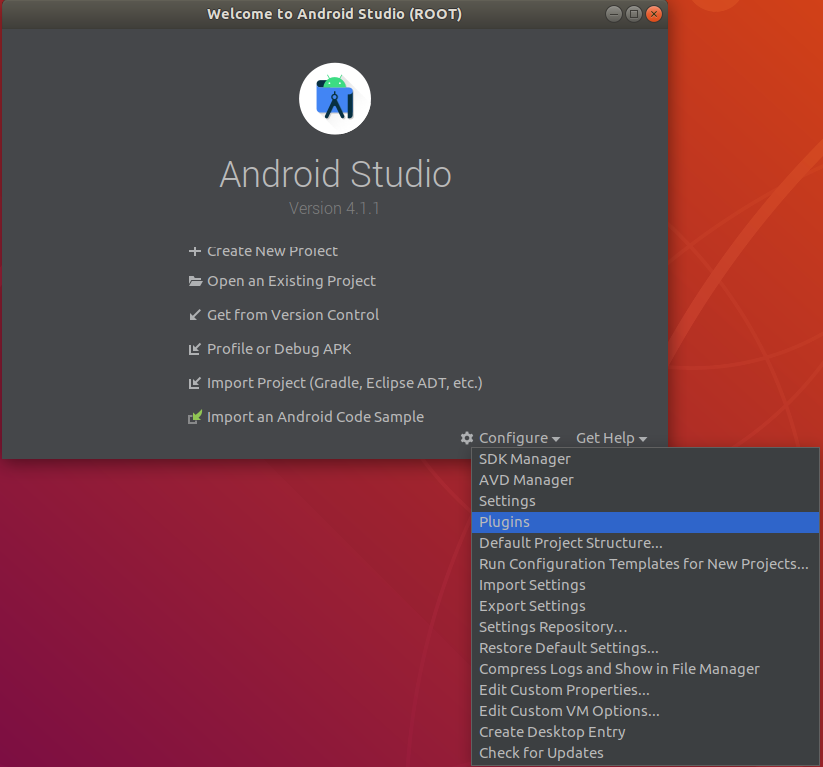

# Flutter Install & Setup on Ubuntu 16.04+

## Install & Configure Flutter

First things first: let's install flutter through the snap store. If you are using Ubuntu 16.04 onwards, you most likely already have the `snap` command installed; if you are not, you can follow the instructions available for your distro at the "Install Snap Store on your Linux distribution" section on [this](https://snapcraft.io/snap-store) page.


With the `snap` command available, install flutter with:

```bash
sudo snap install flutter --classic
```

After flutter has finished installing, run a basic checkup which will also perform some automatic configuring:

```bash
flutter doctor -v
```


Flutter has been installed, nice!

## Install & Configure Java

First of all, we need to get the community-backed Open Java Development Kit before being able to use Android Studio. To get the latest stable verion of Java 8 (other versions can sometimes show some unpredictable problems while working alongside Flutter as of May 2021, so I recommend installing OpenJDK 8; don't worry, OpenJDK 8 is set to receive support at least until 2024), open your terminal and run:

```bash
sudo apt-get update && sudo apt-get install openjdk-8-jdk
```

After a successful installation, it is time to set the ```$JAVA_HOME``` environment variable, used by default by many applications which interact with your local java installation, Android Studio among them.

Get a list of the currently installed JDKs in your system:

```bash
sudo update-alternatives --config java
```

Choose from the list of locally installed versions (remember that Java 8 is the easiest to use with Flutter) the one which you would like to be the system's default and set ```$JAVA_HOME``` to its path, **without including the ```/bin``` portion onwards of the path** (in my case for instance the correct path was ```/usr/lib/jvm/java-8-openjdk-amd64```):

```bash
#JAVA_HOME=<your_java_installation_path>, same as below if you followed instructions
JAVA_HOME="/usr/lib/jvm/java-8-openjdk-amd64" # my local path after installing openjdk-8
echo "JAVA_HOME=\"$JAVA_HOME\"" >> ~/.bashrc # sets JAVA_HOME env var for current user
echo 'export PATH=$PATH:$JAVA_HOME/bin' >> .zshrc # adds java's binaries to your path
source ~/.bashrc && echo $JAVA_HOME # verifies that the variable was perenially set
```

## Install & Configure Android Studio to run with Flutter

Download Android Studio [here](https://developer.android.com/studio).

After your download finishes, extract the Android Studio package into the `/usr/local/` directory:

```bash
sudo tar -C /usr/local -zxvf ~/Downloads/<android_studio_package>.tar.gz
```

After a successful extraction, run Android Studio's installation script:

```bash
bash /usr/local/android-studio/bin/studio.sh
```

This should pop up the install wizard. Follow the wizard's instructions for the standard installation and you should eventually arrive at the starter screen. Select Configurations at the lower right corner and click on "Plugins":



Install the "Flutter" official plugin, published by **flutter.dev**:


You will be prompted to install the Dart plugin (Flutter's base programming language) before proceeding. Click 'Ok' and restart the Android Studio IDE. The option to start a Flutter project should be visible now; click on it, then select 'Flutter Application' and click on 'Next'.

You should be greeted by the project configuration screen. Configure your project's name, location and description as you wish, and point the field "Flutter SDK" to ```/home/<your_user_name>/snap/flutter/common/flutter```:


In case the above path is not available, open a terminal and run:

```bash
flutter doctor -v
```

You should then be greeted with the starter project screen:


Almost done, now you need to accept the android licenses and double check your flutter installation's ownership in order to avoid future surprise build errors due to resources denied for Android Studio. Open up your terminal and run:

```bash
flutter doctor --android-licenses # accept Google's licenses, necessary to build the app
sudo chown -R $USER:$USER /home/$USER/snap/flutter # confirm you are the owner of local flutter
```
Now Android Studio is finally setup to run Flutter projects. Nice!
You should also enable the Desktop Entry for Android Studio. In your project screen, click on "Tools" then "Create Desktop Entry":


The Android Studio shortcut should be available from the "Activities" menu now.


## Enabling Hardware Virtualization for the Android Emulator

In order to run the emulator, we must first set up your CPU's hardware virtualization capabilities.

Run ```kvm-ok``` in your terminal and your output should indicate whether KVM acceleration can be used or not (Kernel Virtual Machine, in a nutshell it is a bridge between the kernel with virtual devices which allows a virtual device to emulate its own hardware directly from the host computer's hardware, take a look [here](https://www.linux-kvm.org/page/FAQ#Preparing_to_use_KVM) for more detailed information); if you have an AMD or Intel CPU, most likely it can.
 
Provided you are indeed able to use KVM acceleration, it is time to setup KVM and authorize the current user for it:

```bash
sudo apt update # update repositories
sudo apt install qemu-kvm libvirt-daemon-system libvirt-clients bridge-utils # base packages
sudo addgroup kvm && sudo addgroup libvirtd # create user authorization groups
sudo adduser $USER kvm && sudo adduser $USER libvirtd # add current user to auth groups
sudo virsh -c qemu:///system list # checks if virtualization is ok
# if everything went fine, your output will be something like:
#
#  Id    Name                           State
#----------------------------------------------------

```

And restart your user session. In the computer, not only the terminal. Log off the system and then login or reboot the PC already, I'll be waiting.

## Using the Android Emulator to Test Apps

Now, open an Android Studio project and click on the 'AVD Manager' (Android Virtual Device) option located in the window's upper right corner:


Click on the "Create Virtual Device" button and a window with a list of devices should pop up, with the 'Phone' category preselected; I recommend you pick a device with Play Store enabled just in case you might want to use it later inside your emulated device. Mine was the Nexus 5.

Click on the 'Next' button and a list of system images (Android OS Versions) should appear:


First, download your target image (by simply clicking on 'Download' right beside the Release Name), select a locally downloaded image and click on 'Next', which should only be highlighted after the image was successfully downloaded.

A window will then show up, offering you to customize your virtual device's properties such as screen orientation on startup, RAM usage, etc. Tweak the device to your possibilities should you like to do so, otherwise you can safely click on 'Finish'.

If everything goes well, you should now see your device listed at the Android Virtual Device Manager window:


Go back to your Android Studio project view; at the same line where the 'AVD Manager' button is located, there is a dropdown list of available devices just to the left of 'main.dart'. Select the emulator you have just set up and click the green 'play' button just to the right of 'main.dart'. In case the emulator is not listed there yet, open the AVD Manager window again and click the green 'play' button under the 'actions' label listed for your virtual device to load and open the emulator before running your Flutter code.


Notice that 'debug' ribbon in the upper right corner? In case you wanna get rid of it, add ```debugShowCheckedModeBanner: false``` as a field of ```MaterialApp```.

## Using a Physical Android Device to Test Apps

You'll need to have a local installation of the Android Debug Bridge in order to enable your computer to trade information (such as APK builds) with any connected Android devices, virtual or otherwise. 

The ADB consists of a client (the interface from which you run commands, which will be the ADB binary installed in your computer for all purposes of this tutorial), a daemon (which executes in the Android device the commands initially sent from the client) and a server (which runs locally in the PC, which has a default listening location at tcp://localhost:5037, and intermediates the communication between the client and the daemon).

Very conveniently, Android Studio currently ships with an ADB, so if you followed the instructions above to install Android Studio, you already have one at your computer. It is possible to install ADB from the Ubuntu repositories alongside the one in Android Studio, but this invites headaches if your computer eventually confuses the locally installed versions, so instead let's setup our linux user to access Android Studio's ADB and then run ADB:

```bash
echo 'export PATH=$PATH:$HOME"/Android/Sdk/platform-tools"' >> .bashrc # adds adb to path
adb start-server # launches adb server
adb devices # lists connected devices
```

After running ```adb devices```, you most likely got an error. This error has registered the ```$LOGNAME``` variable which contains the current user name, you will use it to insert your user into the ```plugdev``` group, in case you are not there already. You also most likely do not have a set of ```udev``` rules for android devices; UDEV rule files specify Ubuntu interactions with plugged in devices, and Ubuntu will refuse to perform certain interactions with your Android device unless it is previously authorized in an UDEV rules file. So, let's correct there errors:

```bash
# add user to plugdev group
sudo usermod -aG plugdev $LOGNAME
# downloads a very thorough UDEV rules file into the appropriate directory
sudo wget -O /etc/udev/rules.d/51-android.rules https://raw.githubusercontent.com/NicolasBernaerts/ubuntu-scripts/master/android/51-android.rules
# gives reading permission to the UDEV android file
sudo chmod a+r /etc/udev/rules.d/51-android.rules
```

Reboot your current Linux user session to apply these changes, then open a terminal and run ```adb devices``` again. In case you still have a UDEV-related error, your device's manufacturer ID probably is not listed in ```/etc/udev/rules.d/51-android.rules```; in this case, look the internet for your device's manufacturer UDEV id and manually add it to the rule list in the same format as the others. Notice how the only field with an unique value amongst the rows is ```ATTR{idVendor}```. If you do not receive any error, you'll notice that your device is listed as 'unauthorized'. Let's unlock the device for USB debugging.

## Unlocking Developer Mode & USB Debugging

In your android device, open up 'Settings', then 'About Phone'; tap your 'Build number' 5-6 times until a toast telling that 'You are now a developer!' pops up. 


Back to 'Settings', open System', you should see that 'Developer Options' were unlocked.  


Tap this new entry check 'USB debugging' just under the 'Debug' section. 


Plug your Android device in your PC via USB, then run ```adb devices``` on your terminal. The output should list your device and also point it is unlocked for debugging. Now, go back to Android Studio, click on the device dropdown list (the one in which you selected your Virtual Device before) and your physical device should now be listed, select it. Click on the 'run' button and you should see the app in your device, ready to be interacted with.

Congratulations! You are now a Flutter developer. If this article has helped you in any way, please remember to 'clap' Medium's little hands. Good luck on your developer journey!